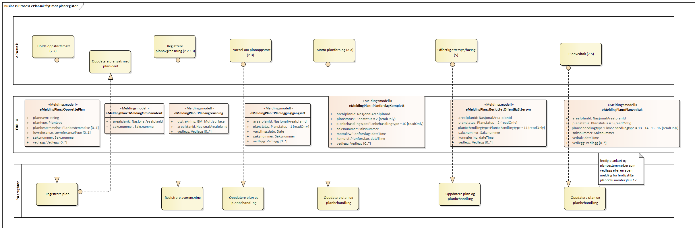
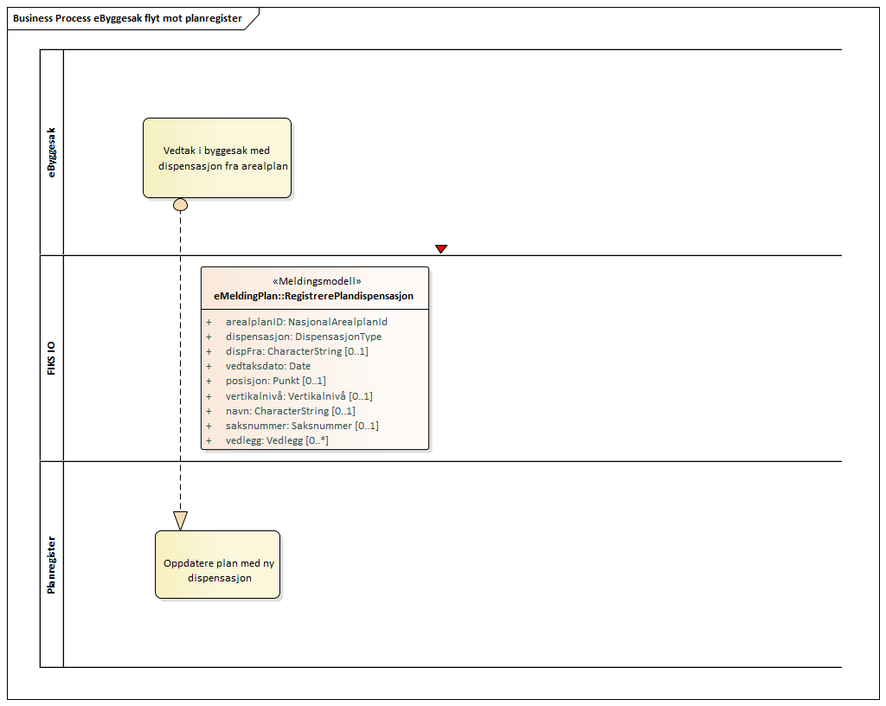

# fiks.io.eplansak.sample

## Oppsett av prosjekt
- Oppdater prosjektet med en egen appsettings.development.json som har med integrasjons passord i FIKS
- Oppdater med egen selvsignert krypteringsnøkkel (privkey.pem) som har lastet offentlig nøkkel opp i FIKS
- Bruk eget virksomhetssertifikat mot ID porten (ThumbprintIdPortenVirksomhetssertifikat)

## Bakgrunn
Dette er et forarbeid til arbeidsoppgaver i fornying av geointegrasjon for å vise muligheter og eksempler på FIKS IO integrasjon.
Flyten i meldinger baserer seg på brukstilfeller og prosessdiagram definert i ePlansak, Nasjonal produktspesifikasjon for arealplan og digitalt planregister(NPAD), samt arbeid med SOSI Plan 5.0.

 
 

## FIKS IO meldingsprotokoll
For ePlansak systemer så er meldingsprotokoll no.ks.fiks. aktuell å støttes som avsender.

